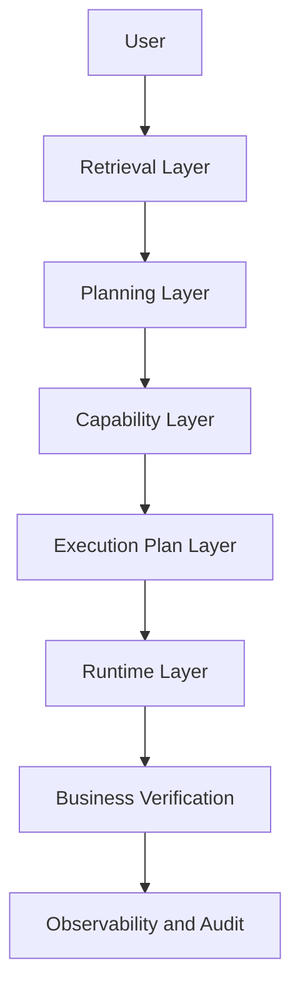
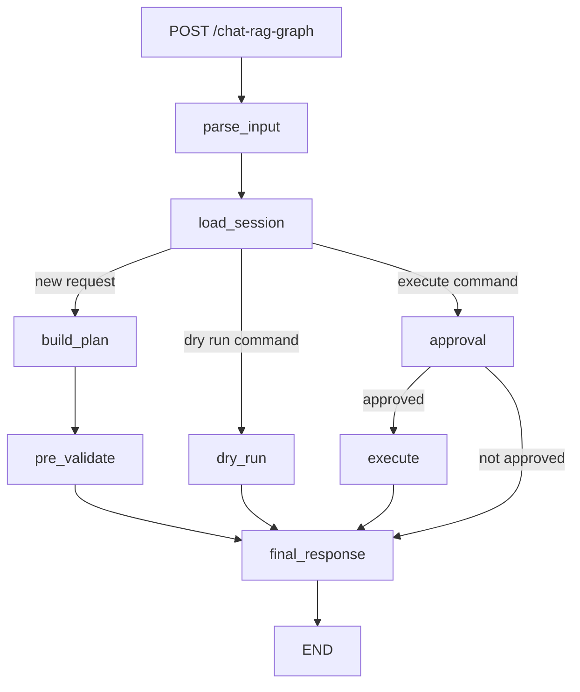

# Architecture

Last verified against the repository: 2026-07-14

## Architectural Intent

AI Banking Lab is evolving toward a layered Agentic Development Platform for Apache Fineract. The central rule is that probabilistic interpretation must terminate before deterministic banking execution begins.

The intended conceptual layers are:



This diagram is a conceptual dependency direction, not a claim that every endpoint traverses every layer. The current application has separate document-Q&A, planning-debug, and LangGraph execution flows.

## Current System Flows

### Document Q&A


This path explains documentation. It does not create or execute banking plans.

### Deterministic planning debug


The planner passes an explicit capability intent, so the execution service does not run retrieval or LLM payload parsing on this path.

### LangGraph execution workflow



Plan creation and execution normally occur in separate requests. A built plan is stored in the in-memory `SessionStore`; LangGraph state is checkpointed in SQLite. A later `dry run` or `execute` command reloads the pending plan.

## Layer Responsibilities

### User and API layer

Package: `app/api/`

`app/api/routes.py` exposes:

| Route | Purpose |
|---|---|
| `GET /health` | Process health response |
| `POST /retrieval/debug` | BM25, semantic, candidate, and reranking diagnostics |
| `POST /planning/debug` | Deterministic goal, path, capability, validation, and plan diagnostics |
| `POST /chat-rag-graph` | LangGraph planning/session/execution workflow |
| `GET /execution/analytics` | Aggregates local JSONL audit records |
| `GET /chat-rag-graph/state/{thread_id}` | Current LangGraph checkpoint state |
| `GET /chat-rag-graph/state/{thread_id}/history` | LangGraph checkpoint history |
| `POST /chat-docs` | Retrieval-grounded documentation answer |

`app/main.py` configures FastAPI, logging, and the router.

### Retrieval layer

Packages: `app/ingestion/`, `app/retrieval/`

Responsibilities:

- load Markdown, text, and HTML documentation;
- chunk source text with overlap;
- write `data/index/chunks.json`;
- create OpenAI embeddings and write `data/index/vectors.json`;
- retrieve lexical candidates with BM25;
- retrieve semantic candidates with cosine similarity;
- combine rankings with weighted Reciprocal Rank Fusion;
- rerank using query-context and domain-term heuristics;
- group evidence, prioritize sections, and create evidence summaries.

Key modules:

- `ingestion/loader.py`: text and HTML loading through BeautifulSoup/lxml.
- `ingestion/chunker.py`: fixed character windows with overlap.
- `ingestion/ingest.py`: local chunk index generation.
- `retrieval/vector_index.py`: batched embedding index generation.
- `retrieval/bm25_retriever.py`: cached BM25 index over local chunks.
- `retrieval/semantic_retriever.py`: query embedding and cosine ranking.
- `retrieval/hybrid_retriever.py`: weighted RRF and debug response.
- `retrieval/reranker.py`: heuristic intent/context reranking.
- `retrieval/context_builder.py`: evidence classification, grouping, summaries, and rendered context.
- `retrieval/util.py`: tokenization and table-of-contents filtering.

Current storage is file-based. There is no vector database module.

### Planning layer

Package: `app/planning/`

Responsibilities:

- classify a natural-language request into a typed `GoalType`;
- map the goal to an ordered `ExecutionPath` of capability invocations;
- verify capability registration;
- delegate validation and plan creation to existing infrastructure;
- return a typed `PlannerResult` with errors, warnings, and debug data.

Modules:

- `planner_models.py`: `GoalType`, `PlanningMode`, `CapabilityId`, `CapabilityInvocation`, `ExecutionPath`, `PlanningRequest`, and `PlannerResult`.
- `goal_classifier.py`: deterministic normalized regex matching for payment, monthly fee, onboarding, and unknown goals.
- `path_planner.py`: static goal-to-root-capability mapping.
- `planner_service.py`: orchestration and delegation to `build_execution_plan()`.

Hard boundary:

```text
Planning may know goals, capability identifiers, paths, validation results,
and the execution-plan output type.

Planning must not know endpoint strings, HTTP methods, Fineract clients,
tool transport definitions, retries, or execution loops.
```

Current limitation: `PlannerService` accepts only one root capability in a path. Message-embedded execution parameters are not parsed by the planning route. See [SESSION_STATE.md](SESSION_STATE.md).

### Capability layer

Package: `app/capabilities/`

Responsibilities:

- represent supported business operations;
- sanitize aliases and defaults;
- validate required capability inputs;
- construct typed `MultiStepExecutionPlan` objects.

`BaseCapability` defines three methods:

```text
sanitize(payload)
validate(payload)
build_plan(payload, account_id, tenant_id)
```

Registered capabilities:

| Intent | Implementation | Plan shape |
|---|---|---|
| `create_savings_monthly_fee` | `CreateSavingsMonthlyFeeCapability` | One direct execution step |
| `pay_savings_charge` | `PaySavingsChargeCapability` | One direct execution step |
| `onboard_client_with_savings_fee` | `OnboardClientWithSavingsFeeCapability` | Six tool-based steps |

Onboarding creates a client, creates a savings account, applies a monthly fee, and verifies the client, account, and charge. Approval and activation are added dynamically by business follow-up routing when verification reports those states.

Current boundary deviation: `create_savings_monthly_fee.py` and `pay_charge.py` construct endpoint strings and HTTP methods directly. The composite onboarding capability uses transport-neutral tool names. The target rule is for transport details to remain in the Runtime/Tool Registry; future changes should not expand the direct-endpoint pattern.

### Execution plan layer

Current model location: `app/capabilities/models.py`

`MultiStepExecutionPlan` contains an intent and ordered `ExecutionStep` objects. An execution step can contain:

- sequence number and action;
- a registered tool name, or direct `method` and `endpoint` fallback;
- payload;
- dependencies;
- output mappings;
- verification marker;
- description and generated curl text.

Plans are data. They do not execute themselves. The runtime interprets them.

Target ownership is the Execution Layer. The current model location under `capabilities/` is a documented structural debt, not a reason to duplicate the model.

### Validation layer

Packages: capability implementations and `app/validators/`

There are two validation phases:

1. **Capability validation:** local payload validation inside each capability before plan creation.
2. **Pre-execution validation:** registered validators that query Fineract before execution.

Current pre-execution validators:

- monthly-fee validator checks that the target savings account is active;
- payment validator checks that the charge exists and has an outstanding balance.

Current boundary note: pre-execution validators call the centralized Fineract client directly for reads. They are not part of the Planning Layer.

### Runtime layer

Package: `app/execution/`

Responsibilities:

- resolve tool names to methods and endpoint templates;
- resolve payload and endpoint templates against runtime values;
- invoke Fineract through one client;
- extract response values into runtime context;
- track verification outcomes;
- append business follow-up steps;
- classify execution failures and apply bounded safe recovery;
- record timing, traces, and audit events.

The runtime has two entry points:

- `dry_run_execution()`: returns what would execute and writes a dry-run audit event; it makes no Fineract request.
- `execute_plan_real()`: executes when `settings.enable_real_execution` is true; otherwise it returns a blocked result.

`app/execution/fineract_client.py` owns authentication, tenant headers, timeouts, HTTP calls, response parsing, and `FineractExecutionError`.

### Runtime Context

`RuntimeContext` is a mutable key/value store scoped to one `execute_plan_real()` call.


`ExecutionStep.output_mapping` maps context keys to dotted response paths, for example `clientId -> body.resourceId`. Later steps reference values with templates such as `{{clientId}}` and `{{savingsId}}`.

### Tool Registry

Registry: `app/execution/tool_registry.py`

Each `ToolDefinition` contains a name, HTTP method, endpoint template, and description. Registered tools are:

- `create_client`
- `create_savings_account`
- `apply_savings_monthly_fee`
- `verify_client`
- `verify_savings_account`
- `verify_savings_charge`
- `approve_savings_account`
- `activate_savings_account`

The registry is the preferred transport mapping for execution steps.

### Business verification

Modules: `app/execution/business_verification.py`, `business_router.py`, `verification.py`

Business verification interprets response bodies for:

- active client state;
- active, pending-approval, or not-active savings-account state;
- active savings-charge state and outstanding amount.

When savings verification reports pending approval, the business router appends approval and re-verification steps. When the account remains inactive, it appends activation and re-verification steps.

Current technical debt: follow-up dates and some dependency numbers are hard-coded in `business_router.py`.

### Recovery layer

Package: `app/recovery/`

`error_classifier.py` maps HTTP status and body text into duplicate, validation, authentication, forbidden, not-found, temporary, or unknown error classes.

`recovery_policy.py` decides whether a failure can be retried and names a strategy. Duplicate business identity data requires human review. Temporary failures are eligible for same-step retry.

`retry_engine.py` can clone and mutate a retry payload. The current executor only automatically retries temporary failures once. Although the policy can return `REAUTHENTICATE_AND_RETRY`, the executor's `should_auto_retry()` only enables `RETRY_SAME_STEP` for temporary failures.

### Observability and audit

Packages: `app/observability/`, `app/execution/audit_log.py`

Implemented mechanisms:

- execution IDs and UTC timing;
- per-step and workflow durations;
- optional LangSmith parent and child runs;
- JSONL audit events under `data/execution/audit_log.jsonl`;
- success, failure, dry-run, and blocked-execution events;
- analytics for statuses, success rate, durations, failed actions, recovery strategies, and average tool duration;
- Mermaid plan diagrams returned in runtime results.

LangSmith failures are swallowed so observability does not stop execution. Audit writes are local synchronous file appends.

### LangGraph integration

Package: `app/langgraph_workflow/`

State is defined by `FineractAgentState`. Nodes parse inputs, load pending sessions, build plans, pre-validate, approve, dry-run, execute, and create the final answer.

Checkpoint configuration:

- SQLite database: `data/checkpoints/langgraph.db`
- checkpointer: `SqliteSaver`
- thread key: API `session_id` mapped to LangGraph `thread_id`

Pending execution plans are also stored in the process-local `SessionStore`. This means checkpoints are persistent but the separate session store is not durable across process restarts.

### Legacy agent service

Package: `app/agent/`

`agent_service.py` implements a session-oriented planning/confirmation flow outside LangGraph. `input_parser.py` extracts selected `key=value` fields and execution commands. `session_store.py` stores dictionaries in memory. No current FastAPI route directly calls `run_agent()`.

Treat this package as existing legacy/support code until its ownership is explicitly decided. Do not delete it without tracing external callers and tests.

## Registries

| Registry | Location | Key | Values |
|---|---|---|---|
| Capability Registry | `app/capabilities/registry.py` | intent string | `BaseCapability` implementations |
| Tool Registry | `app/execution/tool_registry.py` | tool name | transport definitions |
| Pre-execution Validator Registry | `app/validators/registry.py` | capability intent | validator implementations |

Registry strings are duplicated across enums, capability classes, validators, prompts, and registries. Runtime lookup detects missing entries, but a single typed source of truth is not yet implemented.

## Package Map

| Package | Primary responsibility |
|---|---|
| `app/agent` | Input parsing and in-memory pending-plan sessions |
| `app/api` | HTTP API boundary |
| `app/capabilities` | Business capability definitions and current plan models |
| `app/core` | Configuration and logging |
| `app/execution` | Runtime transport, tools, context, verification, audit |
| `app/ingestion` | Documentation loading and chunk index creation |
| `app/langgraph_workflow` | Stateful workflow orchestration |
| `app/observability` | Timing, traces, and audit analytics |
| `app/planning` | Deterministic goal and capability-path planning |
| `app/recovery` | Error classification and recovery policy |
| `app/retrieval` | Lexical/semantic search, fusion, reranking, context |
| `app/schemas` | Shared API models |
| `app/services` | Cross-layer orchestration, OpenAI calls, guardrails, legacy helpers |
| `app/validators` | Fineract-backed pre-execution checks |

## Important Boundaries

1. Planning must not import execution transport or Fineract clients.
2. LLM responses are proposals/input data, never permission to execute.
3. All supported business workflows must resolve through registered capabilities.
4. Runtime is the only owner of actual Fineract writes.
5. Transport mappings should use the Tool Registry; direct endpoints in capabilities are current debt.
6. Capability validation must complete before plan creation.
7. Pre-execution validation may read external state but must not perform business writes.
8. Runtime context is execution-scoped and must not leak between sessions.
9. Verification failures may add governed follow-up steps; they must not silently count as success.
10. Audit and tracing must not expose secrets or unnecessary customer data.

## Configuration and Deployment

`app/core/config.py` loads `.env` and requires `OPENAI_API_KEY` at import time. The default Fineract base URL, username, password, tenant, and real-execution flag are hard-coded in the model. These are current implementation facts and security/configuration debt.

Deployment artifacts:

- `Dockerfile`: Python 3.12 Uvicorn container on port 8000.
- `docker-compose.yml`: MariaDB and a Litecore/Fineract-compatible image; the admin UI is commented out.
- `.github/workflows/cd-banking-ai-assistant.yml`: manual/main-branch image build to GHCR followed by an external GitOps manifest update.

## Current Architectural Gaps

See [SESSION_STATE.md](SESSION_STATE.md) and the Sprint validation report for priority and evidence. The main gaps are:

- planner input extraction and payload precedence;
- lowercase versus uppercase goal API contract;
- true multi-capability plan composition;
- direct endpoint knowledge in two capability implementations;
- direct Fineract reads in pre-execution validators;
- hard-coded follow-up dates and dependency assumptions;
- in-memory pending-plan sessions alongside persistent graph checkpoints;
- limited automated tests and stale endpoint scripts;
- raw onboarding payload prints and configuration defaults unsuitable for production.
